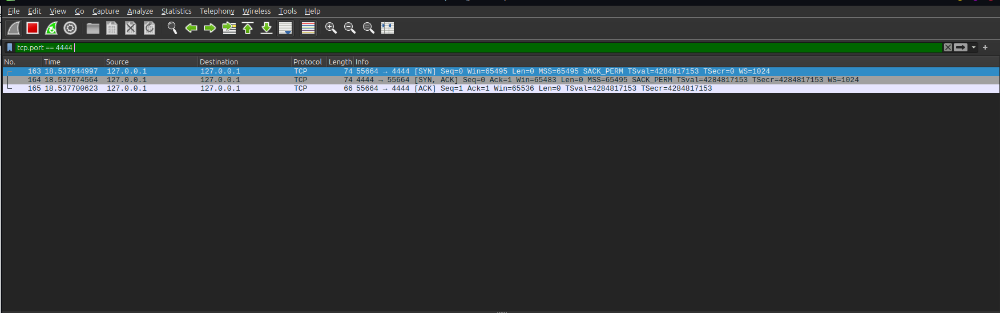

# Lab 01: TCP Three-Way Handshake Analysis

## 🎯 Objective
Analyze how a reliable TCP connection is established between a client and a server using a 3-way handshake.

## 🖥️ Environment
- **OS:** Linux Mint
- **Analyzer:** Wireshark

## 🔄 Procedure
1. Started Wireshark packet capture on the active network interface.
2. Initiated a connection attempt to trigger a TCP handshake.
3. Applied display filter: `tcp.flags.syn == 1` or filtered by the target TCP port.
4. Isolated the full three-way handshake sequence (`SYN` -> `SYN-ACK` -> `ACK`).

## 🔍 Packet Breakdown Table

| Step | Packet Type | Sender -> Receiver | Flags | Purpose |
| :--- | :--- | :--- | :--- | :--- |
| 1 | SYN | Client -> Server | `[SYN]` | Connection request & sequence synchronization |
| 2 | SYN-ACK | Server -> Client | `[SYN, ACK]` | Server acknowledgment & reverse connection request |
| 3 | ACK | Client -> Server | `[ACK]` | Final acknowledgment; connection established |

## 📸 Captured Packets

## 🛡️ Security Perspective
Understanding normal handshake mechanics is essential for identifying anomalies such as:
- **SYN Floods:** High volume of `SYN` packets without completing the `ACK` phase (Denial of Service).
- **Stealth Scans:** Half-open `SYN` scans used by tools like Nmap to discover open ports without opening a full connection.
