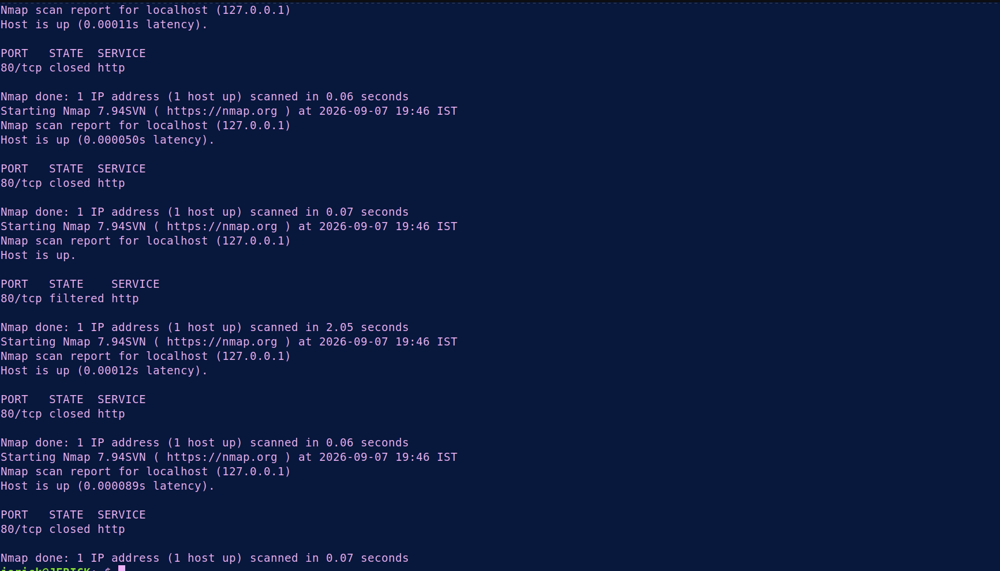
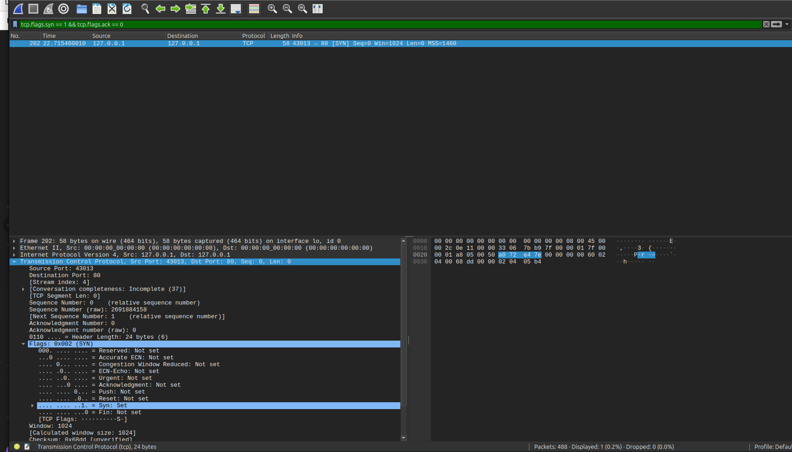
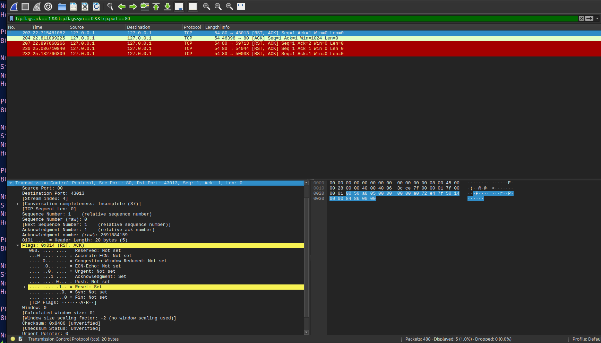
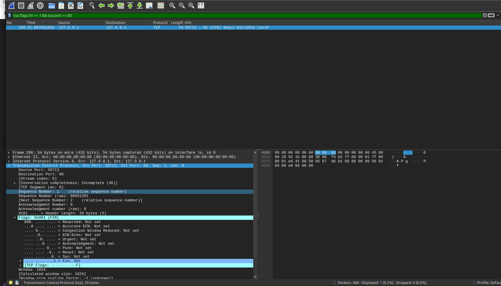
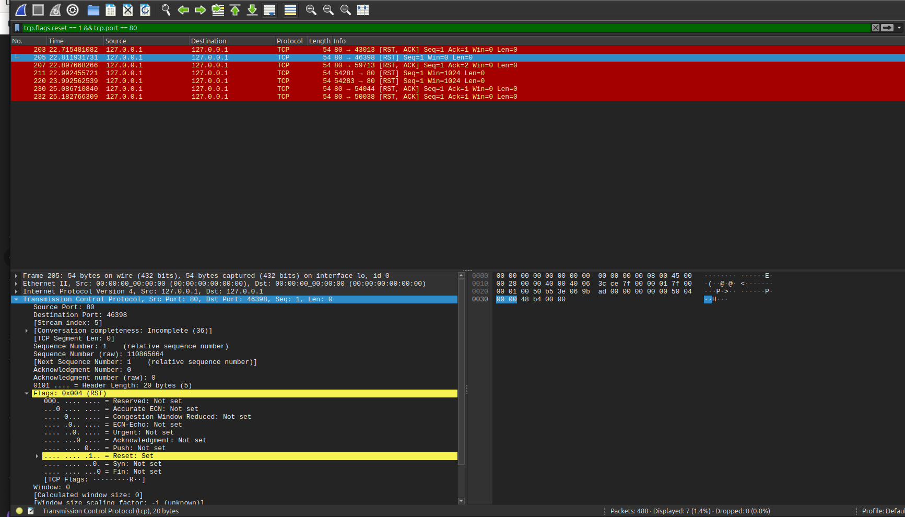
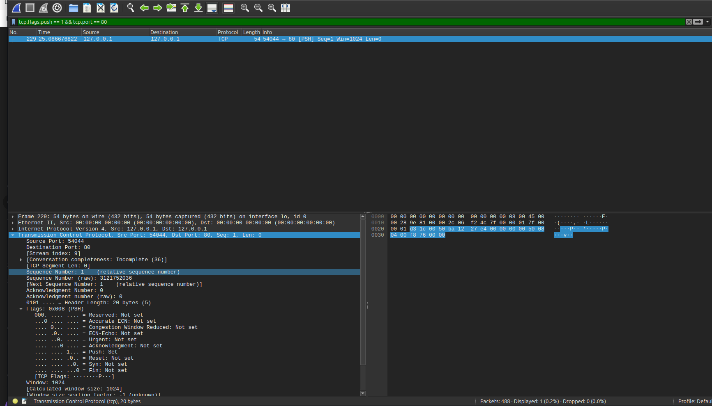
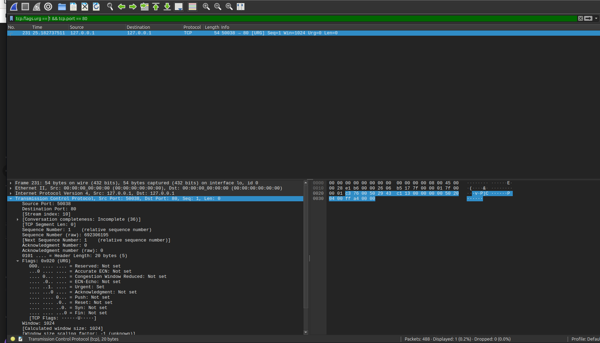

# Lab 02: TCP Control Flags — Attack Emulation & Detection Analysis

## 🎯 Objective
Emulate reconnaissance attacks by injecting individual TCP control flags using Nmap (`--scanflags`) and analyze the resulting traffic from both an attacker's terminal view and a defender's packet inspection perspective.

## 🖥️ Environment
- **Attacker Machine:** Linux Mint
- **Target Host:** Localhost (`127.0.0.1`) / Target Gateway
- **Tools:** Nmap (Traffic Generation), Wireshark (Packet Inspection)

## ⚔️ Attack Phase (Reconnaissance & Flag Injection)

Executed custom TCP flag scans against the target to evaluate host responses and probe firewall state handling.

### Attack Commands Executed
- **SYN Scan:** `sudo nmap --scanflags SYN 127.0.0.1 -p 80`
- **ACK Scan:** `sudo nmap --scanflags ACK 127.0.0.1 -p 80`
- **FIN Scan:** `sudo nmap --scanflags FIN 127.0.0.1 -p 80`
- **RST Scan:** `sudo nmap --scanflags RST 127.0.0.1 -p 80`
- **PSH Scan:** `sudo nmap --scanflags PSH 127.0.0.1 -p 80`
- **URG Scan:** `sudo nmap --scanflags URG 127.0.0.1 -p 80`

### 📸 Attacker Terminal Output

---

## 🛡️ Detection & Traffic Analysis Phase

### 🔍 Flag Behavior & Packet Response Matrix

| Scan Type | Injected Flag | Wireshark Display Filter | Target Response (Closed Port) | Target Response (Open Port) |
| :--- | :--- | :--- | :--- | :--- |
| **SYN Scan** | `SYN` | `tcp.flags.syn == 1 && tcp.flags.ack == 0` | `RST-ACK` | `SYN-ACK` |
| **ACK Scan** | `ACK` | `tcp.flags.ack == 1 && tcp.flags.syn == 0` | `RST` | `RST` |
| **FIN Scan** | `FIN` | `tcp.flags.fin == 1` | `RST` | Silent Drop |
| **RST Scan** | `RST` | `tcp.flags.reset == 1` | No Response | No Response |
| **PSH Scan** | `PSH` | `tcp.flags.push == 1` | `RST` | Silent Drop |
| **URG Scan** | `URG` | `tcp.flags.urg == 1` | `RST` | Silent Drop |

### 📸 Captured Packet Evidence

#### 1. SYN Flag Analysis

#### 2. ACK Flag Analysis

#### 3. FIN Flag Analysis

#### 4. RST Flag Analysis

#### 5. PSH Flag Analysis

#### 6. URG Flag Analysis

---

## 🛡️ Security Perspective
Understanding TCP control flag manipulation is critical for identifying network threats:
- **Firewall Evasion:** Non-standard flag combinations (e.g., `FIN` without an established session) exploit differences in system RFC implementations to map open ports while bypassing simple stateless firewalls.
- **Firewall Mapping:** An `ACK` scan does not open a full TCP connection. It is used exclusively to determine whether ports are filtered (blocked) or unfiltered based on whether a `RST` response is returned.
- **Session Hijacking / RST Attacks:** Attackers can inject forged `RST` packets into an active stream to force connection termination.
