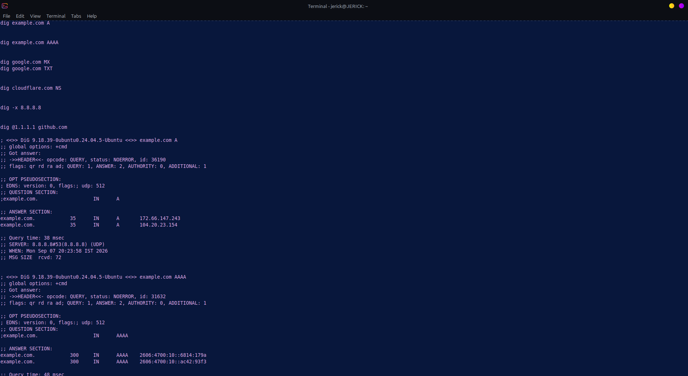
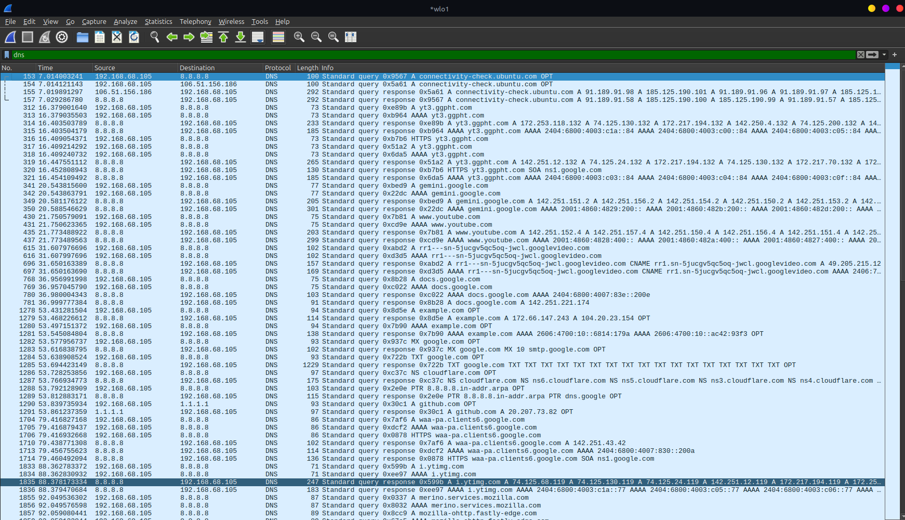
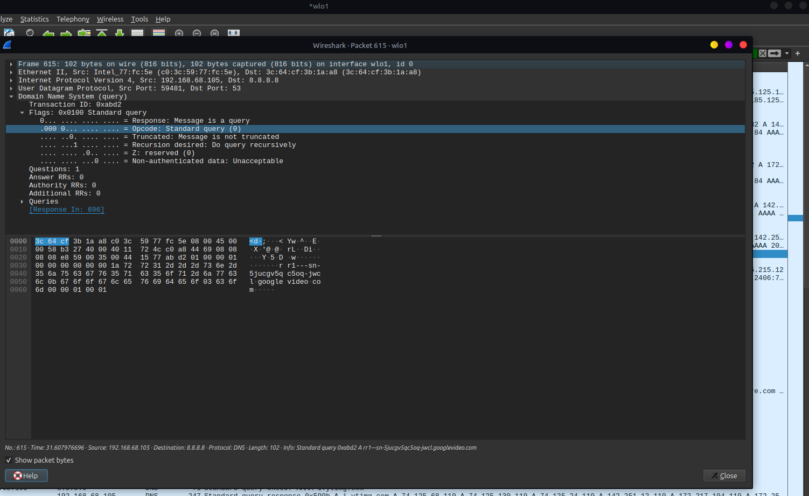

# Lab 03: Domain Name System (DNS) Protocol Analysis & Inspection

## 🎯 Objective
Analyze the mechanics of Domain Name System (DNS) resolution over UDP, inspect various DNS resource record types (`A`, `AAAA`, `MX`, `TXT`, `NS`, `PTR`), and examine the security implications of unencrypted DNS traffic.

## 🖥️ Environment
- **Attacker/Client Machine:** Linux Mint
- **Tools:** `dig` (Domain Information Groper), Wireshark (Packet Inspection)

---

## ⚔️ ATTACK & QUERY PHASE: Reconnaissance via DNS Enumeration

DNS lookups are heavily utilized during the initial reconnaissance phase of an attack to discover active hostnames, mail servers, and infrastructure providers.

### Executed Commands
- **Standard IPv4 Lookup:** `dig example.com A`
- **IPv6 Lookup:** `dig example.com AAAA`
- **Mail Server Enumeration:** `dig google.com MX`
- **TXT Record Inspection (SPF/DMARC Verification):** `dig google.com TXT`
- **Name Server Lookup:** `dig cloudflare.com NS`
- **Reverse Pointer Lookup:** `dig -x 8.8.8.8`

### 📸 Terminal Execution Output

---

## 🛡️ DETECTION & ANALYSIS PHASE: Protocol Inspection

In Wireshark, DNS operates primarily over **UDP port 53**. Packets were captured and analyzed to verify transaction flags, query types, and answer structures.

### 🧪 DNS Resource Records Matrix

| Record Type | Description / Function | Observed Command | Wireshark Filter |
| :--- | :--- | :--- | :--- |
| **A** | Maps hostname to IPv4 address | `dig example.com A` | `dns.qry.type == 1` |
| **AAAA** | Maps hostname to IPv6 address | `dig example.com AAAA` | `dns.qry.type == 28` |
| **MX** | Identifies Mail Exchange servers | `dig google.com MX` | `dns.qry.type == 15` |
| **TXT** | Stores text data (SPF, DKIM, verification) | `dig google.com TXT` | `dns.qry.type == 16` |
| **NS** | Delegates authoritative name servers | `dig cloudflare.com NS` | `dns.qry.type == 2` |
| **PTR** | Reverse DNS lookup (IP to Hostname) | `dig -x 8.8.8.8` | `dns.qry.type == 12` |

---

### 📸 Packet Capture Evidence

#### 1. DNS Query and Response Sequence

#### 2. DNS Header & Answer Flags Inspection

---

## 🛡️ Security Perspective

- **DNS Spoofing / Cache Poisoning:** Plaintext DNS over UDP (port 53) lacks integrity verification. Attackers can forge responses with matching Transaction IDs to redirect users to malicious IP addresses.
- **DNS Tunneling:** Malicious actors use TXT or CNAME queries to encapsulate non-DNS protocol data (such as SSH or C2 commands) through firewalls that permit outbound port 53 traffic.
- **Mitigation & Detection:**
  - Enforce **DNSSEC** (DNS Security Extensions) to cryptographically sign records.
  - Implement **DoH (DNS over HTTPS)** or **DoT (DNS over TLS)** to encrypt queries against on-path eavesdropping.
  - Monitor for anomalous volumes of TXT/NXDOMAIN queries in SOC SIEM solutions.
