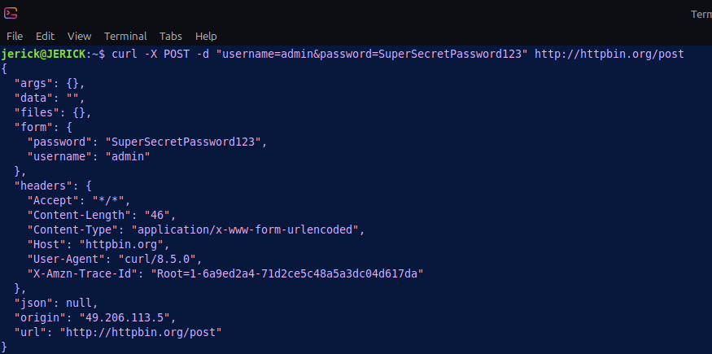
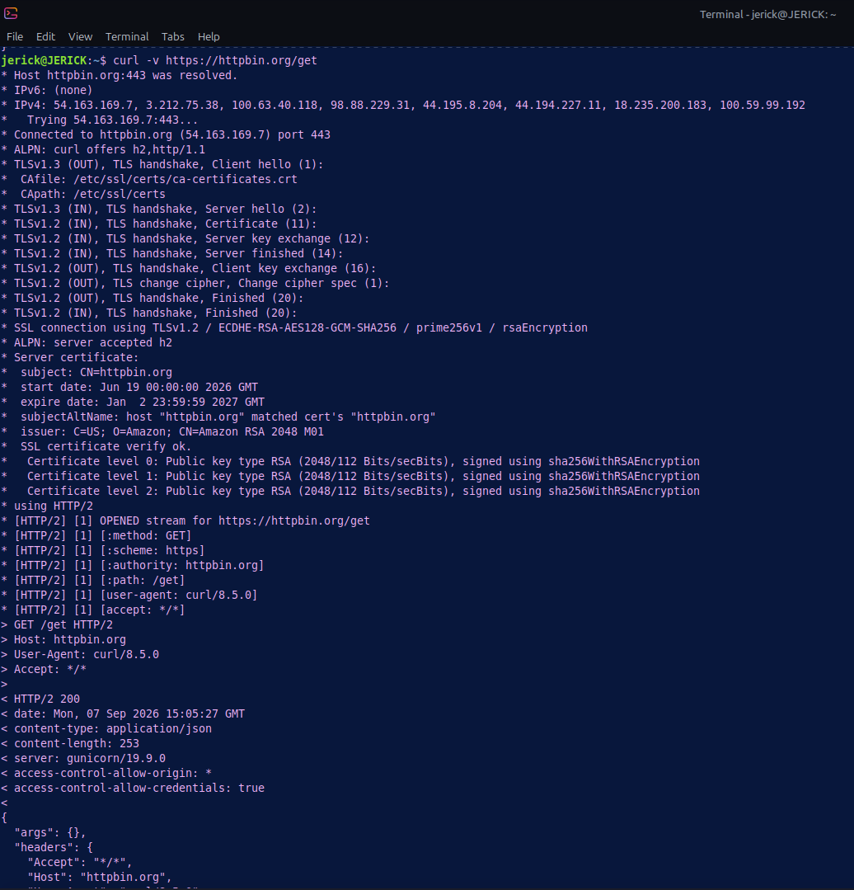
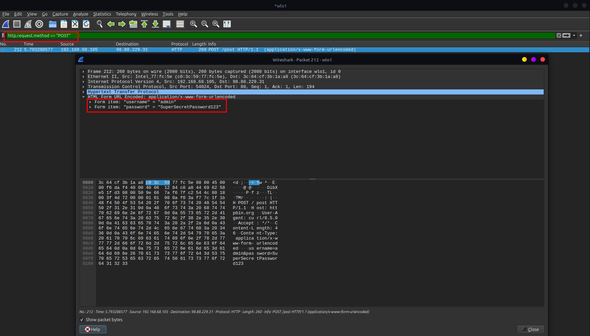
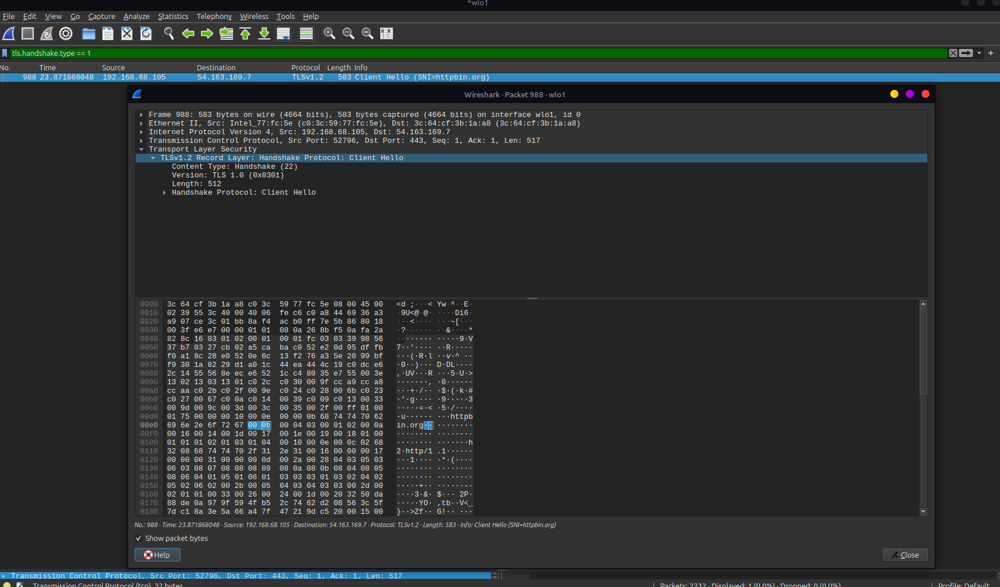

# Lab 04: HTTP vs. HTTPS — Plaintext Credential Analysis & TLS Inspection

## 🎯 Objective
Analyze the security risks associated with cleartext web traffic by intercepting simulated login credentials over HTTP (port 80) and comparing the payload visibility against encrypted HTTPS (port 443 / TLS) sessions.

## 🖥️ Environment
- **Attacker/Client Machine:** Linux Mint
- **Tools:** curl (Traffic Generation), Wireshark (Packet Analysis)

## ⚔️ Attack Phase (Credential Harvesting & Web Traffic Generation)

Attacking local networks via Man-in-the-Middle (MitM) positioning allows malicious actors to sniff cleartext web sessions and harvest sensitive authentication tokens.

### Executed Commands
- **Plaintext HTTP POST Request (Credential Submission):**
  `curl -X POST -d "username=admin&password=SuperSecretPassword123" http://httpbin.org/post`
- **Encrypted HTTPS GET Request:**
  `curl -v https://httpbin.org/get`

### 📸 Attacker Terminal Output

#### 1. Plaintext HTTP POST Request Output

#### 2. Encrypted HTTPS GET Request Output

---

## 🛡️ Detection & Traffic Analysis Phase

Captured traffic was analyzed in Wireshark to contrast HTTP plaintext visibility against TLS session encryption.

### 🧪 Protocol Comparison Matrix

| Protocol | Port | Transport | Payload Visibility | Wireshark Display Filter | Security Impact |
| :--- | :--- | :--- | :--- | :--- | :--- |
| **HTTP** | `80` | TCP | Plaintext (Unencrypted) | `http.request.method == "POST"` | High risk; credentials and cookies exposed in transit |
| **HTTPS** | `443` | TCP (TLS) | Ciphertext (Encrypted) | `tls.handshake.type == 1` | Secure; payload protected against network sniffing |

### 📸 Captured Packet Evidence

#### 1. Harvested Cleartext Credentials (HTTP Stream)

#### 2. Encrypted TLS Application Data Payload (HTTPS)

---

## 🛡️ Security Perspective
Understanding the differences between encrypted and cleartext traffic is critical for enterprise security posture:
- **Risks of Unencrypted HTTP:** Any network device along the path (untrusted Wi-Fi, compromised routers, malicious ISPs) can read or modify HTTP traffic via Sniffing or MitM injection.
- **TLS Protection:** HTTPS uses Transport Layer Security (TLS) to guarantee Confidentiality (encryption), Integrity (tamper protection), and Authenticity (server certificates).
- **Mitigation Controls:**
  - Enforce **HSTS (HTTP Strict Transport Security)** on web servers to forbid HTTP fallbacks.
  - Deploy **WAF (Web Application Firewalls)** to inspect incoming HTTPS traffic via SSL/TLS termination.
