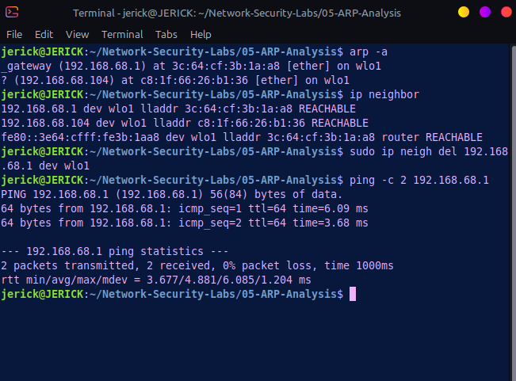
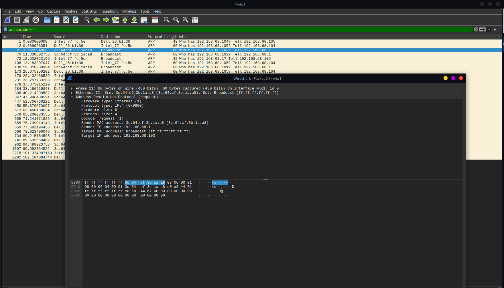
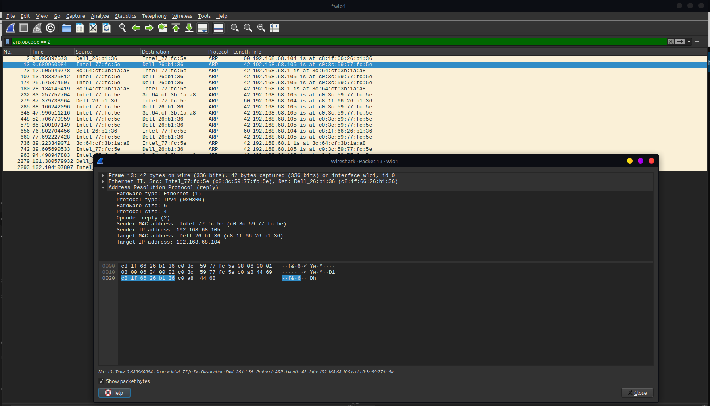

# Lab 05: Address Resolution Protocol (ARP) — Traffic Analysis & Poisoning Risks

## 🎯 Objective
Analyze how Address Resolution Protocol (ARP) maps IPv4 addresses to Media Access Control (MAC) addresses on local networks, inspect ARP Request/Reply packet structures in Wireshark, and evaluate the risks of unauthenticated ARP Spoofing/Poisoning.

## 🖥️ Environment
- **Attacker/Client Machine:** Linux Mint
- **Tools:** `arp`, `ip neighbor`, `ping`, Wireshark (Packet Inspection)

## ⚔️ Attack Phase (Reconnaissance & Cache Manipulation)

In local area networks (LANs), attackers exploit the stateless nature of ARP by sending gratuitous or forged ARP responses to map IP addresses to an attacker's MAC address (ARP Poisoning/MitM).

### Executed Commands
- **Display Local ARP Cache:** `arp -a`
- **Delete Specific ARP Entry:** `sudo ip neigh del 192.168.1.1 dev wlo1`
- **Force ARP Request Generation:** `ping -c 2 192.168.1.1`

### 📸 Attacker Terminal Output

---

## 🛡️ Detection & Traffic Analysis Phase

Captured ARP packets were analyzed in Wireshark to observe hardware/protocol address mapping and flag anomalies.

### 🧪 ARP Packet Fields Matrix

| Field Name | Description / Function | Observed Value |
| :--- | :--- | :--- |
| **Hardware Type** | Specifies the network protocol type | Ethernet (1) |
| **Protocol Type** | Specifies the internetwork protocol | IPv4 (`0x0800`) |
| **Opcode** | Identifies the operation | `1` (Request) / `2` (Reply) |
| **Sender MAC Address** | Hardware address of the transmitting node | Source MAC |
| **Sender IP Address** | IPv4 address of the transmitting node | Source IP |
| **Target MAC Address** | Destination hardware address | `00:00:00:00:00:00` (Request) / Target MAC (Reply) |
| **Target IP Address** | Destination IPv4 address | Requested IP |

### 📸 Captured Packet Evidence

#### 1. ARP Request & Reply Packet Capture

#### 2. ARP Packet Header & Address Details

---

## 🛡️ Security Perspective
Because ARP operates without authentication, any device on the local network segment can send forged ARP replies:
- **Man-in-the-Middle (MitM):** By poisoning the ARP caches of both a victim host and the default gateway, an attacker routes all subnet traffic through their interface to sniff, modify, or drop packets.
- **Mitigation & Defense:**
  - **Dynamic ARP Inspection (DAI):** Enable DAI on managed switches to validate ARP packets against a trusted DHCP snooping binding database.
  - **Static ARP Tables:** Hardcode critical gateway MAC addresses on high-security endpoints.
  - **Detection:** Monitor SIEM/IDS systems for high frequencies of unsolicited (gratuitous) ARP replies or MAC address duplicate warnings.
