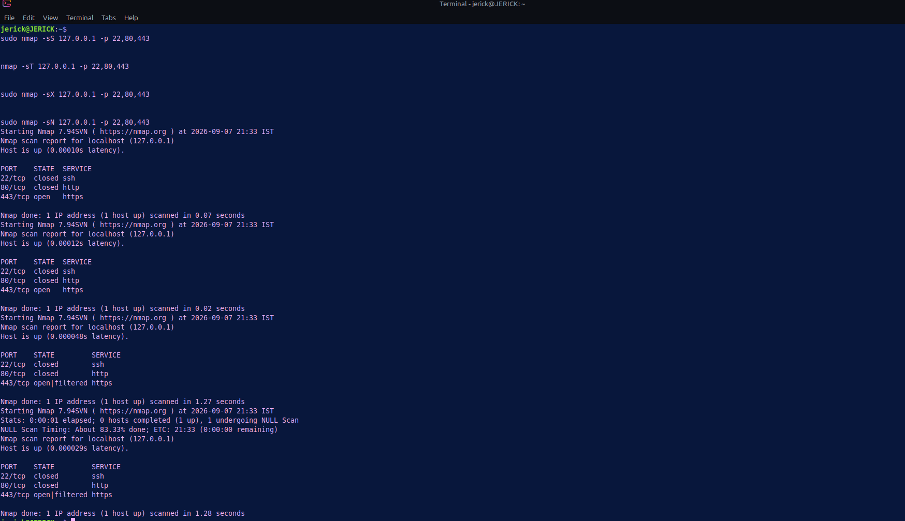
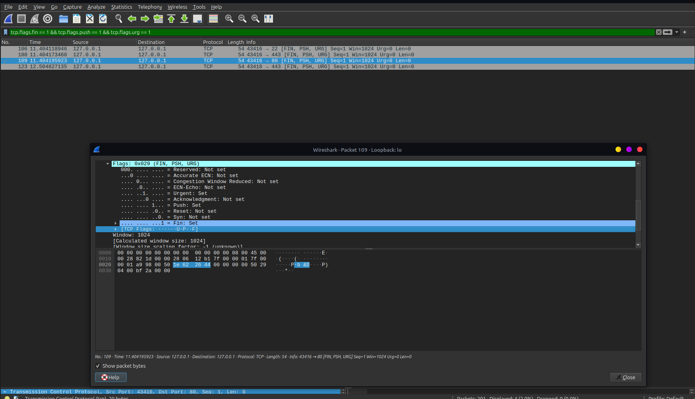
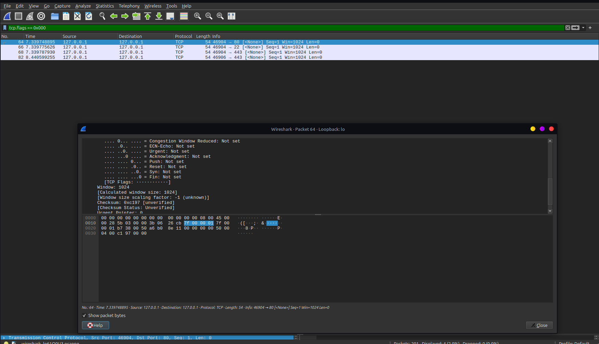

# Lab 06: TCP Port Scan Detection & Packet Signature Analysis

## 🎯 Objective
Emulate common TCP port scanning techniques (SYN, Connect, Xmas, Null), inspect their unique packet flags and connection states in Wireshark, and design detection rules for Intrusion Detection Systems (IDS).

## 🖥️ Environment
- **Attacker Machine:** Linux Mint
- **Target Host:** Localhost (`127.0.0.1`) / Local Gateway
- **Tools:** Nmap (Reconnaissance), Wireshark (Packet Inspection)

## ⚔️ Attack Phase (Port Scanning & Reconnaissance)

Port scanning is used during initial network reconnaissance to discover open ports, running services, and OS characteristics.

### Executed Commands
- **TCP SYN Scan (Stealth):** `sudo nmap -sS 127.0.0.1 -p 22,80,443`
- **TCP Connect Scan:** `nmap -sT 127.0.0.1 -p 22,80,443`
- **Xmas Scan:** `sudo nmap -sX 127.0.0.1 -p 22,80,443`
- **Null Scan:** `sudo nmap -sN 127.0.0.1 -p 22,80,443`

### 📸 Attacker Terminal Output


---

## 🛡️ Detection & Traffic Analysis Phase

Captured scan traffic was analyzed in Wireshark to identify signature differences between standard connections and scan patterns.

### 🧪 Scan Signature & Behavior Matrix

| Scan Type | Nmap Flag | Connection State | Packet Flag Signature | Wireshark Display Filter |
| :--- | :--- | :--- | :--- | :--- |
| **SYN Scan** | `-sS` | Half-Open (RST sent after SYN-ACK) | `SYN` only | `tcp.flags.syn == 1 && tcp.flags.ack == 0` |
| **Connect Scan** | `-sT` | Full 3-Way Handshake | `SYN` -> `SYN-ACK` -> `ACK` -> `RST` | `tcp.flags.reset == 1` |
| **Xmas Scan** | `-sX` | Anomalous (RFC 793 Probe) | `FIN, PSH, URG` | `tcp.flags.fin == 1 && tcp.flags.push == 1 && tcp.flags.urg == 1` |
| **Null Scan** | `-sN` | Anomalous (RFC 793 Probe) | No flags set (`0x000`) | `tcp.flags == 0x000` |

### 📸 Captured Packet Evidence

#### 1. Xmas Scan Packet Capture (FIN, PSH, URG Flags)


#### 2. Null Scan Packet Capture (No Flags Set)


---

## 🛡️ Security Perspective

- **Scanning Mechanics:** SYN scans are preferred by attackers because they do not complete the full TCP 3-way handshake, often avoiding basic application-level logging. Xmas and Null scans exploit RFC 793 edge cases to determine port states without triggering standard SYN filters.
- **IDS/NIDS Detection:** Network Intrusion Detection Systems detect scans by tracking high rates of incomplete connections or identifying invalid TCP flag combinations.
- **Example Snort Detection Rule (Xmas Scan):**
  ```text
  alert tcp $EXTERNAL_NET any ->$HOME_NET any (msg:"SCAN Xmas Scan Attempt"; flags:FPU; sid:1000002; rev:1;)
