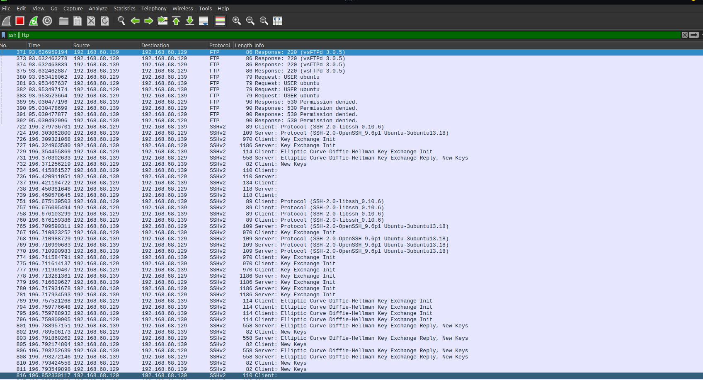
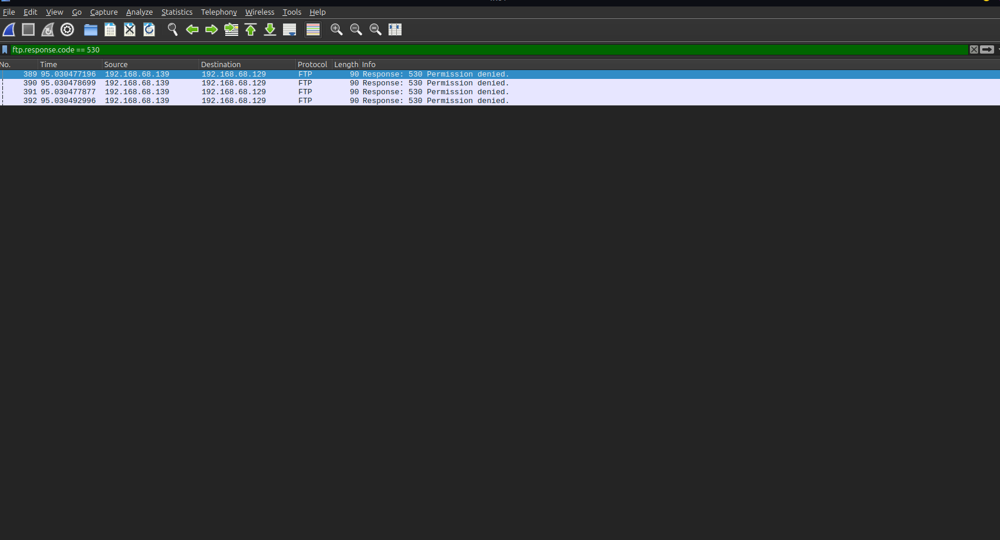

# Lab 08: Brute-Force Network Detection & Authentication Analysis

## 🎯 Objective
Emulate automated password guessing attacks against remote authentication services (SSH/FTP) using Hydra, analyze packet rates and failure indicators in Wireshark, and develop threshold-based detection rules for Security Operations Center (SOC) monitoring.

## 🖥️ Environment
- **Attacker Machine:** Linux Mint
- **Target Host:** Localhost (`127.0.0.1`) / Target Test Server
- **Tools:** Hydra (Authentication Testing), Wireshark (Traffic Inspection)

## ⚔️ Attack Phase (Automated Credential Stuffing)

Brute-force attacks rely on high-volume dictionary attempts against authentication interfaces to compromise valid user credentials.

### Executed Commands
- **SSH Brute-Force Execution:** `hydra -l admin -P /usr/share/wordlists/metasploit/namelist.txt ssh://127.0.0.1 -t 4`
- **FTP Brute-Force Execution:** `hydra -l user -P /usr/share/wordlists/metasploit/namelist.txt ftp://127.0.0.1 -t 4`

### 📸 Attacker Terminal Output


---

## 🛡️ Detection & Traffic Analysis Phase

Captured traffic was analyzed in Wireshark to observe high connection velocity, rapid key exchanges, and explicit service error codes.

### 🧪 Authentication Attack Response Matrix

| Service | Transport Port | Key Packet Indicator | Wireshark Display Filter | Detection Signature |
| :--- | :--- | :--- | :--- | :--- |
| **SSH** | `22` | Rapid TCP Handshakes & Disconnects | `ssh \|\| (tcp.port == 22 && tcp.flags.syn == 1)` | High volume of SYN packets followed immediately by RST frames |
| **FTP** | `21` | Response Code `530 User cannot log in` | `ftp.response.code == 530` | Repeated 530 response codes from a single source IP |

### 📸 Captured Packet Evidence

#### High-Density Authentication Traffic Stream & Packet Inspection


---

## 🛡️ Security Perspective

- **Attack Footprint:** Automated tools generate distinct operational footprints characterized by tight time deltas between connections, consistent packet sizes, and abnormal TCP reset rates.
- **Defensive Mitigations:**
  - **Fail2ban / IP Rate Limiting:** Automatically drop traffic from source IPs exceeding threshold failures (e.g., 5 failed attempts in 60 seconds).
  - **Key-Based Authentication:** Disable password authentication for SSH (`PasswordAuthentication no` in `sshd_config`).
- **Example Snort Detection Rule (FTP Brute-Force Threshold):**
  ```text
  alert tcp $EXTERNAL_NET any ->$HOME_NET 21 (msg:"NIDS FTP Brute-Force Attempt"; content:"530 Login incorrect"; detection_filter:track by_src, count 10, seconds 30; sid:1000008; rev:1;)
