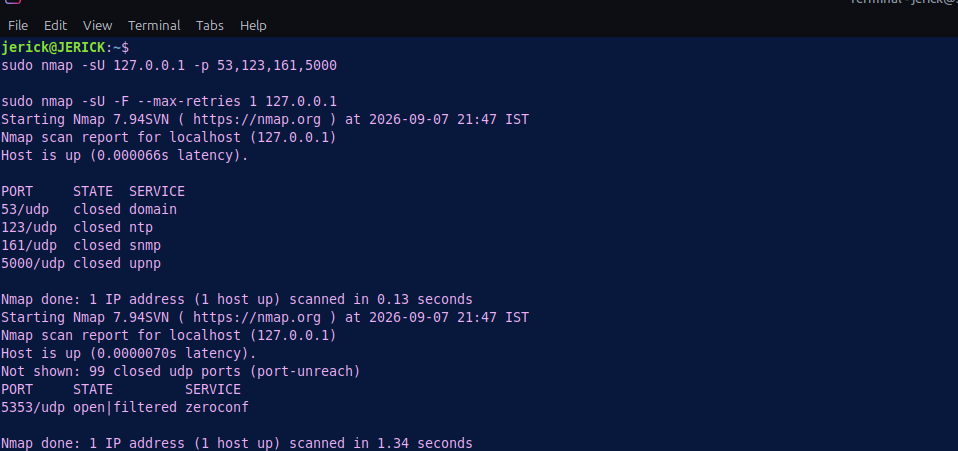
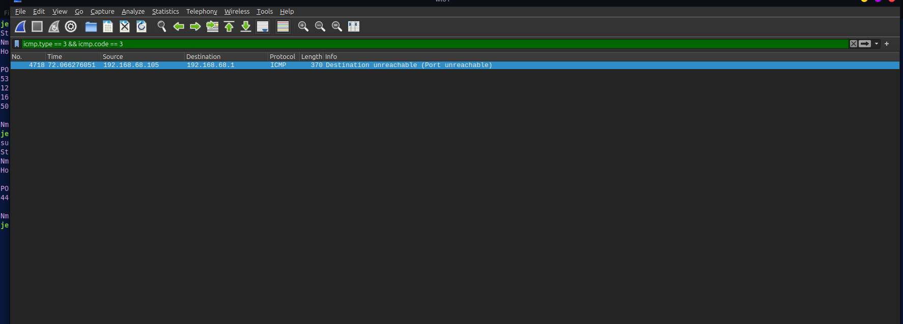
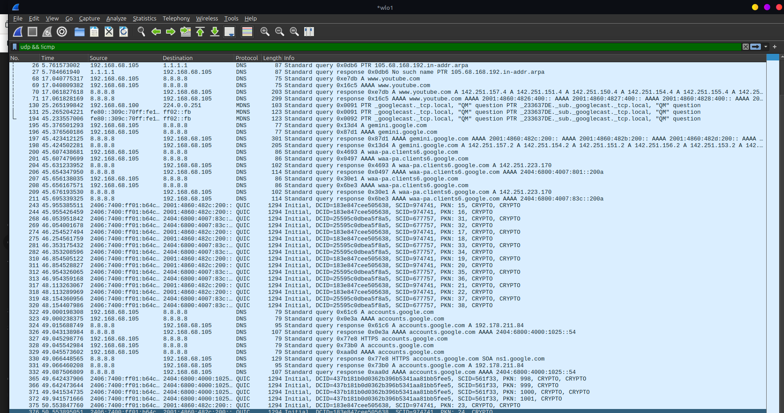

# Lab 08: UDP Scan Detection & ICMP Error Response Analysis

## 🎯 Objective
Analyze non-connection-oriented UDP port scanning mechanics using Nmap (`-sU`), inspect resulting ICMP Destination Unreachable (Port Unreachable) error messages in Wireshark, and define detection signatures for connectionless reconnaissance.

## 🖥️ Environment
- **Attacker Machine:** Linux Mint
- **Target Host:** Localhost (`127.0.0.1`) / Target Gateway
- **Tools:** Nmap (Reconnaissance), Wireshark (Packet Inspection)

## ⚔️ Attack Phase (UDP Reconnaissance)

Unlike TCP, UDP lacks handshakes or stateful connection flags. UDP scans identify port states by sending raw datagrams and listening for ICMP error responses or protocol-specific replies.

### Executed Commands
- **Targeted UDP Scan:** `sudo nmap -sU 127.0.0.1 -p 53,123,161,5000`
- **Fast UDP Scan (Rate Limited):** `sudo nmap -sU -F --max-retries 1 127.0.0.1`

### 📸 Attacker Terminal Output


---

## 🛡️ Detection & Traffic Analysis Phase

Captured UDP scan datagrams and ICMP responses were inspected in Wireshark to determine protocol behavior across open and closed ports.

### 🧪 UDP Scan Response Matrix

| Target Port State | Expected Target Response | Wireshark Display Filter | Inferred Nmap Port State |
| :--- | :--- | :--- | :--- |
| **Closed Port** | ICMP Type 3, Code 3 (Port Unreachable) | `icmp.type == 3 && icmp.code == 3` | `closed` |
| **Open Port (Active Service)** | Protocol-specific response (e.g., DNS answer) | `udp.port == <port>` | `open` |
| **Filtered / Firewall** | No response (Packet dropped silently) | `udp && !icmp` | `open\|filtered` |

### 📸 Captured Packet Evidence

#### 1. ICMP Port Unreachable Response Traffic


#### 2. UDP & ICMP Packet Header Details


---

## 🛡️ Security Perspective

- **UDP Scan Challenges:** UDP scanning is significantly slower than TCP scanning because operating systems strictly rate-limit ICMP error response generation (e.g., Linux kernel ICMP rate limiting).
- **Attacker Evasion:** Attackers often combine UDP scans with service-version probing (`-sUV`) to force application-layer responses (such as DNS requests or NTP queries) rather than relying solely on ICMP timeouts.
- **Example Snort Detection Rule (ICMP Port Unreachable Sweep):**
  ```text
  alert icmp $HOME_NET any ->$EXTERNAL_NET any (msg:"NIDS ICMP Port Unreachable Rate Anomaly"; icode:3; itype:3; detection_filter:track by_src, count 20, seconds 5; sid:1000003; rev:1;)
